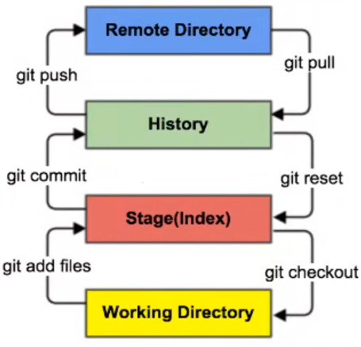

# 首次使用

Git的系统级配置文件保存在安装目录下etc文件夹中的gitconfig中，用户配置（global）保存在C盘汇总的用户目录下的gitconfig

```bash
# 查看配置
# -匹配简写，--匹配全称
# 查看全部配置
git config --list
git config -l

# 查看系统配置
git config --system -l

# 查看本地（全局）配置
git config --global -l
```


安装git后首先要设置用户名称和email地址。代表提交时你的身份信息

```bash
git config --global user.name "30-501-PC"
git config --global user.email "lvge821641@outlook.com"
```


# Git基本理论

四个工作区域

1. 工作目录（Working Directory）：平时存放代码的地方
2. 暂存区（Stage/Index）：用于临时存放改动，实际上只是一个文件，保存即将提交的文件列表信息
3. 资源库（Repository）：就是安全存放数据的位置，这里面有提交过的所有版本数据。其中HEAD只想最新放入仓库的版本
4. 远程仓库（Remote Directory）：托管代码的服务器




# Git项目搭建

- 有两种方法

  - ```bash
    # 创建全新的仓库
    # 在需要创建仓库的目录执行
    git init
    ```

  - ```bash
    # 克隆一个远程仓库
    git clone [url]
    ```

    

# Git文件操作

```bash
# 查看文件状态
git status [filename]

# 查看所有文件状态
gut status

# 添加所有文件到暂存区
git add .

# 添加暂存区中的内容到本地仓库
git commit -m "XXX"
```


# 分支

``` bash
# 列出所有本地分支
git branch

# 列出所有远程分支
git branch -r

# 新建一个分支，但依然停留在当前分支
git branch [branch-name]

# 新建一个分支，并切换到该分支
git checkout -b [branch]

# 合并指定分支到当前分支
git merge [branch]

# 删除分支
git branch -d [branch-name]

# 删除远程分支
git push origin --delete [branch-name]
git branch -dr [remote/branch]
```


