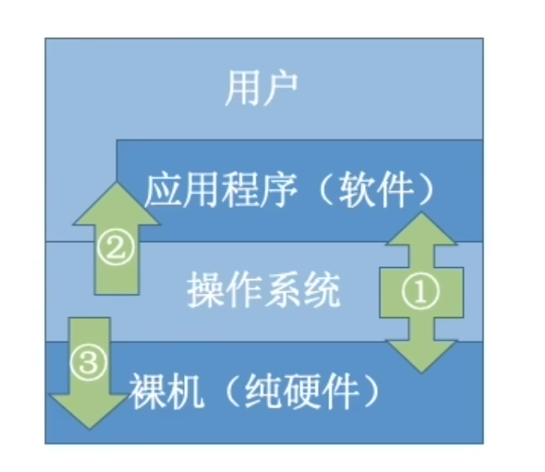

# 一、基础概念

## 1.1 操作系统的概念、功能

操作系统是指控制和管理整个计算机系统的硬件和软件资源，并合理地组织调度计算机的工作和资源的分配；以提供给永和和其他软件方便的接口和环境；它是计算机系统重最基本的系统软件。

> 1. 操作系统是系统资源的管理者
> 2. 向上层提供方便易用的服务
> 3. 是最接近硬件的一层软件

操作系统提供的功能：

1. 处理机管理
2. 存储器管理
3. 文件管理
4. 设备管理

操作系统向上层提供简单易用的服务（相对于机器指令）：

- 给用户使用的
	1. GUI
	2. 命令接口：联机命令接口和脱机命令接口（命令行工具
- 给软件/程序员使用的： 程序接口，即系统调用，用户通过程序简介使用

## 1.2 操作系统的特征

> **并发**
>
> 指两个或者多个时间在同一==时间间隔==内发生。这些事件宏观上是同时发生的，但微观上是交替发生的。（并行是指两个或多个事件在==同一时刻==发生）
>
> 操作系统的并发性是指计算机系统中“同时”运行着多个程序，这些程序宏观上看是同时运行着的，而微观上看是交替运行的。
> 操作系统就是伴随着“多道程序技术”而出现的。因此，==操作系统和程序并发是一起诞生的==。
>
> 单核CPU同一时刻只能执行一个程序，各个程序只能并发地执行。
> 多核CPU同一时刻可以同时执行多个程序，多个程序可以并行地执行。

> **共享**
>
> 共享即资源共享，指系统中的资源可以供内存中多个并发执行的进程共同使用。
>
> 互斥共享：一个时间段内只允许一个进程访问该资源
> 同时共享：允许一个时间段内多个进程“同时”对它们进行访问（微观可能是同时的，也可能是交替的）

**并发和共享互为存在条件**

> **虚拟**
>
> 把物理上的实体变为若干个逻辑上的对应物。物理实体是实际存在的，逻辑对应物是用户感受到的。
>
> 空分复用
> 时分复用

> **异步**
>
> 在躲到程序环境下，允许多个程序并发执行，但由于资源有限，进程的执行不是一贯到底的，而是走走停停，以不可预知的速度向前推进，这就是进程的异步性。

## 1.3 操作系统的运行机制

> **内核**
>
> 操作系统最重要最核心的部分，也是最接近硬件的部分。
> 甚至可以说，一个操作系统只要有内核就够了（Docker中就是仅需Linux内核）
> 操作系统的功能未必都在内核中，比如GUI

内核作为“管理者”，有时会让CPU执行一些“特权指令”，如：清理内存指令。这些指令影响重大，只允许“管理者”使用。
应用程序只能使用“非特权指令”，如：加法减法等

程序运行的过程其实就是CPU执行一条一条的机器指令的过程
==CPU在设计和生成的时候就划分了特权指令和非特权指令==，因此CPU执行一条指令前就能判断出其类型。
虽然CPU可以分辨指令的类型，但是CPU无法分辨当前的指令来自于内核还是应用程序。
为了解决这个问题，CPU有两种状态，“内核态”和“用户态”

- 处于内核态时，说明此时正在执行的是内核程序，此时可以执行特权指令
- 处于用户态时，说明此时正在运行的是应用程序，此时只可以执行非特权指令

> CPU中有一个寄存器，叫做程序状态字寄存器（PSW），其中有一个二进制位，标记了CPU当前的状态
> 实际上，把PSW从内核态切换为用户态也是由一条特权指令完成的
>
> 当CPU处于用户态时，如果执行到了一条特权指令。
> CPU通过检查PSW发现处于用户态，因此该非法事件会引发一个中断信号，CPU检查到中断信号后，会立即变为内核态，并停止运行当前的应用程序，转而运行处理中断信号的内核程序。当处理完中断引发的事件后，CPU再把使用权交给应用程序

- 内核态->用户态：执行一条特权指令———修改PSW的标志位为用户态，这个动作意味着操作系统主动让出CPU使用权
- 用户态->内核态：由“中断”引发，硬件自动完成，出发中断信号意味着操作系统将强行夺回CPU的使用权

> 除了非法使用特权指令外，还有很多事件会触发中断信号。一个共性是，但凡需要操作系统接入的地方，都会出发中断信号

## 1.4 中断和异常

CPU上会运行两种程序，==操作系统的内核程序==，==应用程序==。在合适的情况下，操作系统内核会把CPU的使用权主动让给应用程序，==中断==是让操作系统夺回CPU使用权的唯一途径，使CPU从用户态变为内核态

中断的类型

1. 内中断（也称为异常）：与当前执行的指令有关，中断信号类源于CPU内部

	- CPU在执行指令时会检查是否有异常发生

	- 例如：试图在用户态执行特权指令，执行除法时除数为零
		- 陷阱，陷入：由陷入指令引发，是应用程序故意引发的
		- 故障：由错误条件引起的，可能被内核程序修复。内核程序修复故障后会把CPU只用全还给应用程序，让它继续执行下去
		- 终止： 由致命错误引发，内核程序无法修复，因此一般不会将CPU使用权交还给应用程序，而是直接终止该应用程序

2. 外中断：与当前执行的指令无关，中断信号来源于CPU外部

	- 应用程序想请求操作系统内核的服务，此时会执行一条特殊的指令——==陷入指令（不是特权指令）==，该指令会引发一个内部中断信号。这时意味着应用程序主动将CPU的控制权交还给操作系统内核，==系统调用==就是通过陷入指令完成的。
	- 每个指令周期的末尾，CPU都会检查是否有外中断信号需要处理
	- 例如：
		- 时钟中断——由内部时钟部件发来的中断信号
		- I/O中断——由输入输出设备发来的中断信号

> **中断机制的基本原理**
>
> 不同的中断信号，需要用不同的中断处理程序来处理。当CPU检测到中断信号后，会根据中断信号的类型去查询==中断向量表==，以此来找到响应的中断处理程序在内存中的存放位置。
>
> ==显然，中断处理程序一定是内核程序，需要运行在内核态==